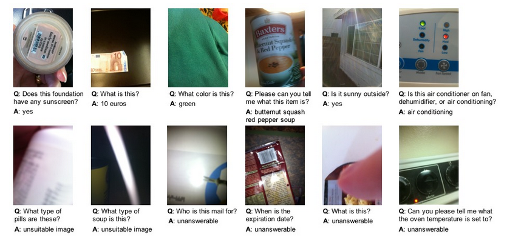
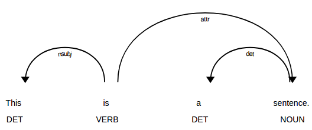
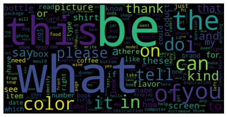
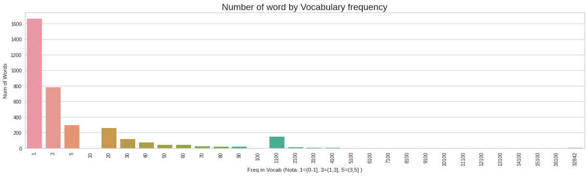
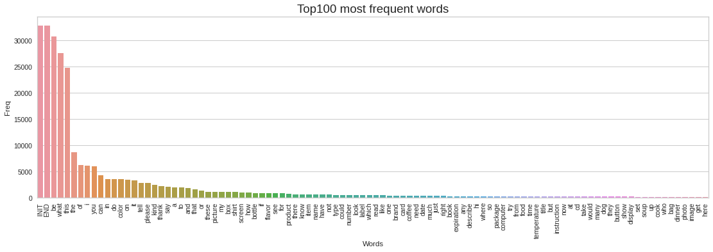
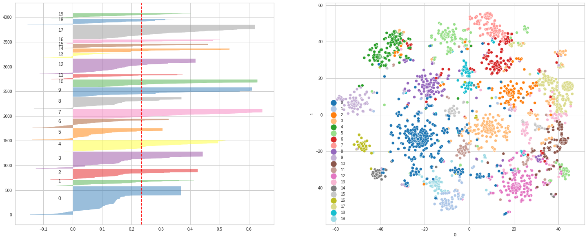

# Práctico N1 (Clustering)

## 1) Introducción y Motivación
En el siguiente trabajo, se explorarán diferentes técnicas de clusterzación con el objetivo de encontrar relaciones entre palabras provenientes de preguntas conversacionales del dataset [VizWiz-VQA](https://vizwiz.org/tasks-and-datasets/vqa/).

[VizWiz](https://vizwiz.org/), es el proyecto responsable de introducir los primeros datasets y retos, los cuales mediante Workshop y llamados a competencias anuales, se mantienen en continuo crecimiento y desarrollo. Los mismos están destinados a motivar la creación de nuevas/mejores tecnología y/o algoritmos de inteligencia artificial asistenciales, para ayudar a personas con impedimentos visuales en las diferentes tareas diarias.

En particular, el dataset VizWiz-VQA, es un conjunto de ternas (pregunta, 10 respuestas, fotografía), construido en base a audios procedentes de consultas que usuarios no videntes realizaban sobre las imagenes que ellos mismos tomaban.

Todo el proyecto fue realizado en la plataforma colaborativa de Google *google Colabority*, de la cual además de brindar practicidad, esta dotada de capacidades para procesar en placas de video (GPU), la cua fue aprovechada para acelerar determinadas partes del pipeline.

En este trabajo se evaluaron tres diferentes caminos para lograr la clusterización:
1. A partir de una matriz de co-ocurrencia formada por relaciones entre palabras en un contexto dado. Es decir, dada la palabra *W0*, se buscaron todas las túplas *W0-Wn* y *Wx-W0*, donde *Wn* y *Wx* son palabras en la misma oración que se encuentran a una distancia menor de **WINDOW_SIZE** de *W0*. Se probaron ventanas de 1,2 y 4 palabras.

2. A partir de una matriz de co-ocurrencia formada por triplas de dependencia entre palabras de una oración dada. Es decir, dada la siguiente oración:
    * Q: "This is a sentence"
    * Triplas: ['this-**nsubj**-is' , 'is-**ROOT**-is', 'a-**det**-sentence' , 'sentence-**attr**-is']  

3. Por último, a partir de la generación de Word Embedding Neuronales, mediante la librería **word2vec** de *gensim*.

## 2) Procesamiento del corpus
El corpus a trabajar estuvo definido por un total de aprox 32000 preguntas con una longitud media de palabras de 6.66; resultado de concatenar los conjuntos Test, Val, y Train, correspondientes a las muestras de entrenamiento, testeo y validación de VizWiz-VQA. 

Previo a la creación de cada una de las matrices de co-ocurrencia, lo primero que se realizó, utilizando la librería **spacy**, fue dividir cada pregunta en oraciones (muchas de ellas formadas por mas de hasta 5 oraciones, dado a que son preguntas conversacionales) y de allí su respectiva lista de tokens. De esta manera, a cada pregunta fue asociada una lista de lista de tokens, manteniendo el contexto y facilitando la creación de tales matrices, sin tener que procesar luego todo nuevamente.

En el proceso, se descartaron token no alfabéticos, se convirtieron a minúsculas y lematizaron. Además, se decidieron agregar los tokens especiales 'INIT' y 'END' al inicio y final de cada pregunta, con la potencial finalidad de poder estudiar que palabras están mas relacionadas a los comienzos y finales de cada una. Ej:

*   **Q**: Is this enchilada sauce or is this tomatoes?  Thank you.
* **Result**: 
	['INIT', 'be', 'this', 'enchilada', 'sauce', 'or', 'be', 'this', 'tomato']
	['thank', 'you', 'END'] 

Este último procedimiento fue aplicado para poder alcanzar los objetivos 1 y 3 nombrados en la sección anterior. 
Para lograr el objetivo 2 (clusterización mediante triplas de dependencia), el proceso fue similar al anterior, con la diferencia de que no se utilizaron los token especiales 'INIT' y 'END', y en lugar de generar listas de token simples, se generaron lista de triplas de dependencia por cada oración de la pregunta de la forma *lemma0-dep-lemma1*, donde **lemma1** es el padre directo de **lemmao** y tiene una dependencia del tipo **dep**. Ej:

* **Q**: Is this enchilada sauce or is this tomatoes?  Thank you.
* **Result**: 
	[('be', 'ROOT', 'be'), ('this', 'det', 'sauce'), ('enchilada', 'compound', 'sauce'), ('sauce', 'nsubj', 'be'), ('or', 'cc', 'be'), ('be', 'conj', 'be'), ('this', 'det', 'tomato'), ('tomato', 'nsubj', 'be')]
	[('thank', 'ROOT', 'thank'), ('you', 'dobj', 'thank')] 

## 3) Análisis de vocabulario
Como resultado de analizar los diferentes tokens obtenidos, se encontraron:
*  Un total de 289946 palabras (lemmas).
*  Exactamente 3888 palabras únicas (lemmas), contando los tokens INIT y END agregados,

### <u>Nube de palabras</u>

### <u>Distribución de frecuencias</u>

### <u>Primeras 100 palabras mas frecuentes</u>

Como se puede observar, las palabras posee una distribución exponencial, siendo *'what'*, *'this'* y *'is' (be)* las más frecuentes, lo que a priori nos estaría indirectamente sugiriendo, que la pregunta **"What this is?"** sería una de las más utilizadas en el dataset.

## 4) Creación de matrices de Co-Ocurrencia (Vectorización)
Partiendo de los pre-procesamientos anteriormente guardados, se crearon las respectivas matrices de co-ocurrencia. Cada matriz fue normalizada (por fila, dada a la distribución exponencial que se observó en las frecuencias de cada palabra en el vocabulario) y luego se redujo su dimensionalidad, utilizando filtrado por umbral de varianza. Es decir, se descartaron todas las características (columnas) que entregaran poca variación. Para esto último se usaron umbrales de varianza de entre **.001** y **.0015**.

En esta etapa se utilizaron las librerías **normalize**, **VarianceThreshold** y **DictVectorizer** de *sklearn*, para normalizar y reducir la dimensionalidad respectivamente.

## 5) Clusterización
Para realizar esta técnica se emplearon la librería  **Kmeans** de *sklearn* y **TSNE** y  **SilhouetteVisualizer** de *yellowbrick*, para visualizar y evaluar los resultados; la primera (t-distributed stochastic neighbor embedding) para reducir la dimensionalidad de la matriz de características y representar en un gráfico 2D las palabras, y la segunda para generar el diagrama de *Silhouette* para ver la consistencia de cada grupo y tener una guía aproximada en el proceso de selección del valor **K** más óptimo.

<u>Nota:</u> Para poder encontrar los centroides de cada conjunto, se configuró la librería para que realice **5** corridas de **600** iteraciónes cada una, y las coordenadas de cada centro sea la media de esas 5 ejecuciones.

## 6) Pruebas y Resultados

En términos generales, se observó que al realizar la clusterización partiendo de la matriz de co-ocurrencias basada en cercanía de palabras (objetivo 1), a medida que se ampliaba el contexto (ie. aumentaba el valor de **WINDOW_SIZE**), los clusteres entregados se solapaban cada vez más.  Esta tendencia también se observó al utilizar Word Embedding Neuronales (objetivo 3). Con respecto a la clusterización partiendo de la matriz generada con las tríplas de dependencia, no se pudo obtener clusteres definidos, sino que en su lugar se originaba un gran clúster con casi el 90% de las palabras en el vocabulario. Una de las hipótesis es que dado a que las peguntas del dataset analizado tienen origen conversacional, puede que el uso de dependencias sintácticas no sea el más adecuado para lograr el objetivo.

A continuación se muestran los resultados entregados de la mejor combinación de parámetros y metodología probada (todas las demás pruebas están disponibles para ver en el notebook). Las figuras de abajo muestra el resultado obtenido empleando como punto de partida una matriz de co-ocurrencia de *correlaciones entre palabras con ventana unitaria*. Se probaron diferentes parámetros y el mejor resultado se obtuvo utilizando:

1. Un filtrado por varianza de **.001** que redujo la matriz normalizada de **(3888, 3888)** a **(3888, 73)**.
2.  Clusterización con parámetros: **k=20**, **max_iter=600** y **n_init=5**.

Aunque no todos los clústeres pueden identificarse unívocamente mediante alguna propiedad, característica gramatical y/o semántica definida, mayoritariamente se pudieron encontrar buenas relaciones en los clusteres 4,7,16,17 y 19 listados al final. Si bien estos son los que a criterio personal, mejor agrupación presentan, todos poseen palabras que no deberían incluir, lo cual no es sorprendente ya que si miramos el diagrama de Silhouette, salvo excepciones, todos presentan una cola izquierda que indica que hay palabras equivocadas. Esto también se refleja en el gráfico de la derecha, cuando se ven puntos alejados de los centros sólidos.

* Cluster 7 - Top 100 most freq words:
    * ('Referentes a alimentos y relacionadas')
------
coffee, food, dog, soup, soda, drink, wine, chip, beer, spice, tea, medicine, some, pop, pill, flower, 
water, meat, yogurt, candy, cereal, car, pizza, plant, cookie, juice, vegetable, tree, vitamin, rice, mail, 
soap, speaker, fruit, animal, bug, keurig, sugar, bread, pie, pasta, cologne, potato, oatmeal, tomato, cigarette, 
fish, pudding, popcorn, creamer, gum, both, crisp, deodorant, flour, seed, tool, muffin, jello, paint, jerky, 
cracker, fudge, burger, gatorade, nut, string, mushroom, guitar, tide, furniture, stereo, metal, life, pan, microphone, 
ointment, tile, variety, vehicle, tobacco, dessert, insect, burrito, alcohol, fall, grass, mine, entree, sam, god, 
stuffing, ram, liquor, broth, spider, copy, popsicle, eggnog, taquito

* Cluster 16 - Top 100 most freq words:
    * ('Palabras de iniciación de pregunta')   
------
what, can, how, could, which, hi, where, who, hello, when, okay, yes, record, ok, sorry, hey, 
oh, yeah, alright, why, excuse, testing, que, head, participate, sometimes, whose, cold, special, spark, whoop, 
jim, x, does, siri, kit, east, finally, translate, si, grab, y, hola, kindly, de, qu, 
slaver, wat, ccan, uncle, whar, infinte, le, alrighty, isd, shh, regina, nah, katie, louie, nutter, 
android, franklin, mrs, hwy, brandon, whatpage, cathy, quest, consume, nicole, emily, evening, ceremony, garbled, wbat, 
michael, ty, fist, 

* Cluster 19 - Top 100 most freq words:
    * ('Mayoritariamente acciones)')
------
tell, if, have, need, just, so, but, would, cook, get, think, will, help, let, turn, give, 
hope, because, send, really, ask, mean, put, appreciate, maybe, hear, buy, before, may, press, believe, 
guess, already, eat, keep, step, understand, feel, d, add, usually, provide, since, weigh, wish, must, 
reason, love, screw, shoot, however, whereabout, tip, online, choose, ya, click, campbell, agree, rainbow, pull, 
honest, calculate, forgot, allow, stouffers, ummm, apologize, connect, tel, folk, fetch, obviously, thought, pride, except, 
accept, suspect, cheat, stupid, stare, wearin, recommend, focused, unplug, previously, zoom, sequence, doubt, frogro, anymore, 
awful, refill, accidentally, notification, decide, orient, invention, upon, retook, 

* Cluster 17 - Top 100 most freq words:
    * (Objetos/sustantivos)
------
say, box, shirt, bottle, product, item, card, book, package, cd, bag, photo, image, paper, jar, thing, 
object, expire, again, work, container, milk, laptop, packet, keyboard, tin, cat, lotion, medication, window, device, 
photograph, sweater, case, perfume, jacket, radio, hair, skirt, remote, menu, tube, yarn, magazine, dress, envelope, 
chair, snack, fabric, glass, place, hat, carton, tie, note, pen, coin, material, necklace, pillow, document, 
candle, purse, cost, painting, sweatshirt, ticket, router, supplement, mug, disc, plate, blouse, wire, blanket, poster, 
recipe, tape, girl, coupon, cabinet, dish, receipt, ring, map, garment, row, jumper, marker, chili, recorder, 
desk, jug, cable, ham, coat, rug, rock, timer, building

* Cluster 4 - Top 100 most freq words:
    * ('Adjetivaciones')
------
up, off, something, black, white, blue, red, regular, chicken, conditioner, dark, upside, salt, coke, sausage, diet, 
drive, brown, high, low, decaf, gold, whatever, orange, beef, pepsi, gray, corn, hamburger, normal, silver, 
ground, dehumidifi, caffeinate, yellow, cinnamon, decaffeinate, lemon, caffeine, hour, negative, blend, positive, plain, breakfast, cut, 
strawberry, tylenol, turquoise, repair, catalina, instant, horizontal, vertical, true, pork, dayquil, warm, medium, crew, cocoa, 
tan, shell, tapioca, daytime, bedtime, file, advil, strip, selector, lime, mild, nyquil, vanilla, heater, pm, 
unsalted, mixed, enchilada, lemonade, grapefruit, nighttime, wheat, classic, itself, calm, sweeten, unsweetened, sour, rightside, fertilizer, 
dehumidifier, chunky, creamy, original, snow, bizwiz, barbecue, blueberry, closed
